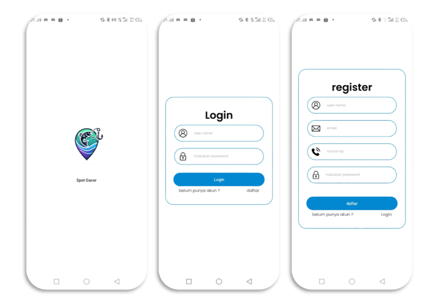
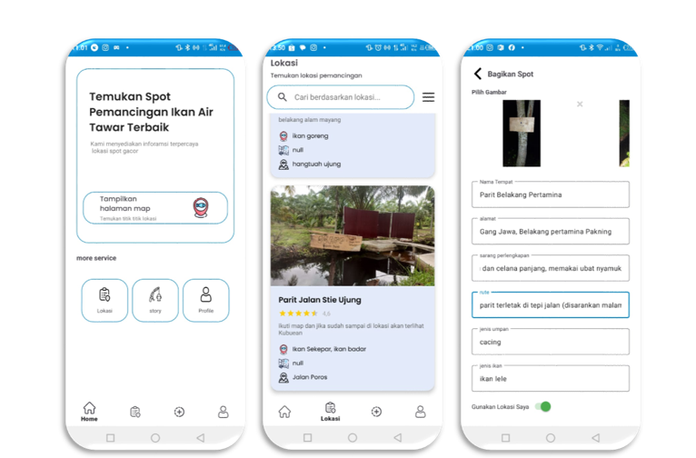
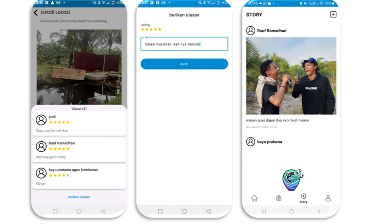
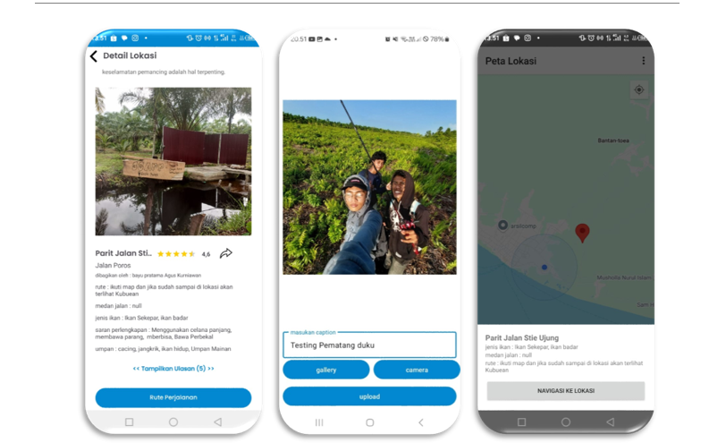
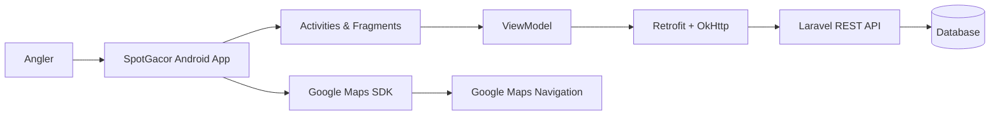
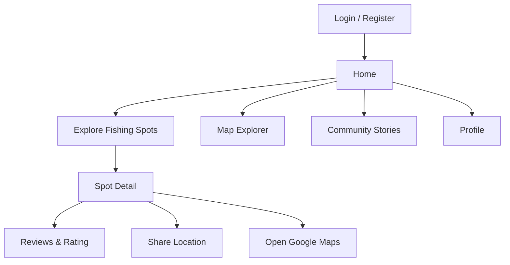

<div align="center">

# 🎣 SpotGacor

### Discover fishing spots. Explore the map. Share the catch.

**SpotGacor** is an Android application that helps anglers discover fishing locations, explore spot details, navigate with Google Maps, share fishing stories, and review locations in one mobile experience.

[](https://kotlinlang.org/)
[](https://developer.android.com/)
[](https://developers.google.com/maps)
[](https://square.github.io/retrofit/)
[](https://laravel.com/)
[](#-system-architecture)

</div>

---

## 🌊 About SpotGacor

Finding a good fishing spot is often based on scattered recommendations and word of mouth. **SpotGacor** brings that information into a single Android application.

Users can discover fishing locations, search by location name or fish type, view spot information, check routes and terrain, see recommended bait and equipment, open navigation in Google Maps, leave ratings and reviews, and share fishing stories with the community.

The Android client communicates with a Laravel REST API using bearer-token authentication.

## 📸 App Preview

<p align="center">
  
  &nbsp;
  
  &nbsp;
  
  &nbsp;
  
</p>

<div align="center">
  <sub>Fishing spot discovery • Location details • Maps • Community experience</sub>
</div>

## ✨ Features

### 📍 Fishing Spot Discovery

- Browse available fishing locations
- Paginated location list
- Search fishing spots by name
- Filter locations by fish type
- View detailed fishing spot information
- Image slider for location photos

### 🗺️ Maps & Navigation

- Display fishing spots as Google Maps markers
- Access the user's current location
- View Normal, Satellite, Terrain, and Hybrid map modes
- Open spot information directly from a map marker
- Launch turn-by-turn navigation through Google Maps
- Share fishing spot coordinates and information

### 🎣 Fishing Information

Each location can provide useful information such as:

- Target fish species
- Recommended bait
- Suggested fishing equipment
- Route information
- Road / terrain conditions
- Address and coordinates
- Community rating and reviews

### 💬 Community

- Add fishing stories with photos
- Browse community stories using Android Paging
- Pull-to-refresh story feed
- Add ratings and reviews to fishing locations
- View comments from other anglers

### 👤 Account & Profile

- Register and login
- Bearer-token authenticated API requests
- View user profile
- Update profile photo from camera or gallery
- Change password
- Logout

## 🧠 System Architecture



### Application data flow

```text
Android UI
   │
   ▼
Activity / Fragment
   │
   ▼
ViewModel / Repository
   │
   ▼
Retrofit + OkHttp
   │
   ▼
Laravel REST API
   │
   ▼
Database
```

## 🛠️ Tech Stack

| Area | Technology |
| --- | --- |
| Platform | Android Native |
| Language | Kotlin |
| UI | XML Layouts + ViewBinding |
| Architecture | ViewModel / Repository pattern |
| Networking | Retrofit + OkHttp |
| Serialization | Gson |
| Authentication | Laravel API Bearer Token |
| Maps | Google Maps SDK for Android |
| Location | Google Play Services Location |
| Pagination | Android Paging 3 |
| Navigation | Android Navigation Component |
| Image Loading | Glide, Coil, Picasso |
| Image Compression | Compressor |
| Backend | Laravel REST API |

## 📂 Project Structure

```text
app/src/main/java/com/bayupratama/spotgacor/
├── data/
│   ├── paging/              # PagingSource for locations & stories
│   ├── response/            # API response models
│   └── retrofit/            # Retrofit configuration & endpoints
│
├── helper/
│   ├── SharedPreferenceToken.kt
│   ├── ViewModelFactory
│   └── Utils.kt
│
└── ui/
    ├── adapter/             # RecyclerView / ViewPager adapters
    ├── auth/
    │   ├── login/
    │   └── register/
    ├── home/
    │   └── ui/
    │       ├── home/
    │       ├── lokasi/      # Spots, detail, review & sharing
    │       ├── map/         # Google Maps & navigation
    │       ├── profile/
    │       └── story/       # Community story feed
    └── splashscreen/
```

## 🔌 Backend

SpotGacor uses a separate Laravel backend repository:

👉 **[SpotGacorBackEnd](https://github.com/bayupra7ama/SpotGacorBackEnd)**

The backend provides the REST endpoints used by the Android application for authentication, fishing locations, reviews, stories, profile data, and media uploads.

## ⚙️ Getting Started

### Requirements

- Android Studio
- Android SDK 24+
- JDK compatible with the Android Gradle Plugin
- Google Maps API key
- Running SpotGacor Laravel backend

### 1. Clone the project

```bash
git clone https://github.com/bayupra7ama/SpotGacor.git
cd SpotGacor
```

### 2. Configure the backend URL

The Retrofit base URL is configured in:

```text
app/src/main/java/com/bayupratama/spotgacor/data/retrofit/ApiConfig.kt
```

Update it to your active backend URL:

```kotlin
Retrofit.Builder()
    .baseUrl("https://YOUR_BACKEND_URL/")
```

> The repository currently uses a development tunnel URL. Replace it with your own development or production API endpoint when running the project.

### 3. Configure Google Maps

Create or use a Google Maps API key with **Maps SDK for Android** enabled.

For development, keep API credentials outside source control and load them from local configuration such as `local.properties`.

Example:

```properties
MAPS_API_KEY=YOUR_GOOGLE_MAPS_API_KEY
```

> Do not commit unrestricted production API keys to a public repository.

### 4. Build and run

Open the project in Android Studio, sync Gradle, select an emulator or Android device, and run the application.

You can also build from the terminal:

```bash
./gradlew assembleDebug
```

Windows:

```powershell
.\gradlew.bat assembleDebug
```

## 🔐 API Authentication

After login, the application stores the user token locally and sends it through OkHttp as:

```http
Authorization: Bearer <token>
```

Authenticated requests are then used for operations such as spot details, reviews, stories, profile updates, and other protected features.

## 🌐 Main API Capabilities

```text
Authentication
├── Register
├── Login
└── Logout

Fishing Spots
├── List & pagination
├── Search / filter
├── Spot detail
├── Add location
├── Photos
└── Map coordinates

Community
├── Stories
├── Upload story photo
├── Reviews
└── Ratings

Profile
├── User detail
├── Profile photo
└── Password update
```

## 🗺️ User Journey



## 🚧 Development Notes

This repository represents the Android client of the SpotGacor system. Some development configuration, including API endpoints and third-party credentials, should be adjusted before production deployment.

Recommended production improvements include environment-based endpoint configuration, restricted Google Maps credentials, automated tests, CI/CD, and release build hardening.

## 🔗 Related Repository

| Repository | Role |
| --- | --- |
| **[SpotGacor](https://github.com/bayupra7ama/SpotGacor)** | Android application |
| **[SpotGacorBackEnd](https://github.com/bayupra7ama/SpotGacorBackEnd)** | Laravel REST API backend |

---

<div align="center">

### 🎣 Find the spot. Cast the line. Share the story.

Made for anglers who want fishing information to be easier to discover and share.

</div>
